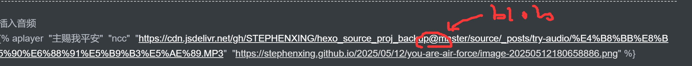

==============
===============
npm install hexo

=====================
====================

node_modules\.bin\hexo  g 

hexo clean
hexo g

hexo s
hexo deploy

hexo new post "约旦河"

除了：git remote remove
删除.git文件夹
有时候还需要：git reset --hard   

git status可以检查我的项目是不是删除了与其他项目的联系

==============
===============
npm install hexo

"https://cdn.jsdelivr.net/gh/STEPHENXING/hexo_source_proj_backup@master/source/_posts/try-audio/

=================
怎样图片居中

    

