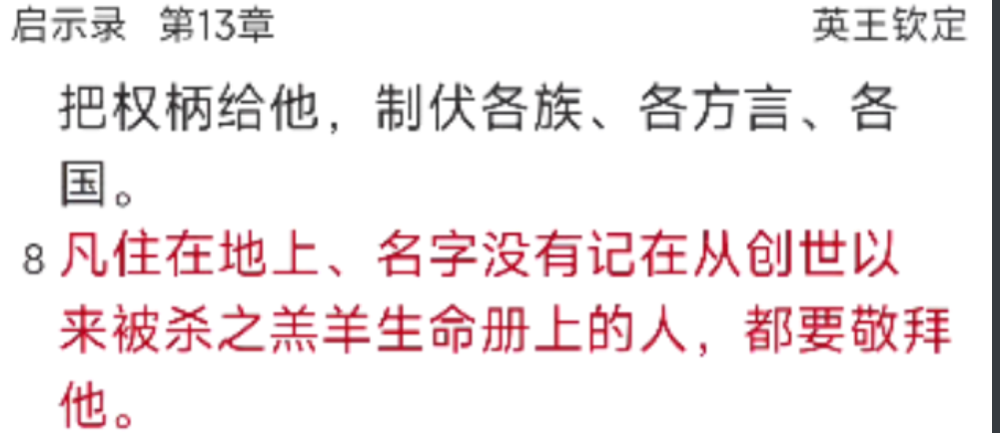
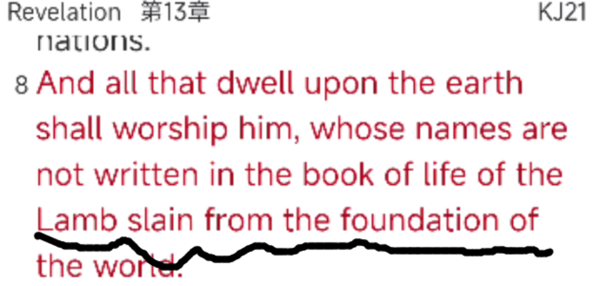

神的救恩是完全的救恩,十字架的救法是奇妙的救法,所以神在**创世以前**就开始准备,构思蓝图。神并不是造了人以后才开始预备,更不是人犯罪以后才计划如何拯救人,乃是在创世以前,由于神的预知、预选与预定,就已经开始为救恩作准备了。这是有圣经根据的。

我们可以想象吗？ 我现在要造一个机器人，但是我知道这个机器人将来会拒绝我，插荆棘在我的头上，吐唾沫在我的脸上，砸钉子穿过我的手。但是我为了能够爱他，跟他分享我的爱，我还是欢欢喜喜的造他。哦，主耶稣的爱是何等长阔高深。

启示录13章8节按原文的意思应该翻译为:“凡住在地上名字没有记在**从创世以来被杀的羔羊**生命册上的人都要拜它。”我们要注意:“从创世以来”这句在原文是修饰“被杀的羔羊”的,并不是修饰那些“名字没有记在羔羊生命册上的人”的,而事实上从创世以来名字没有记在生命册上的人，不可能都在大灾难中生活在地上而去拜那兽,可见主耶稣这被杀的羔羊乃是在创世以来就已经预定被杀了。可见,神在创世的初始就早已命定以基督的受死来作为人类得救的赎价。

使徒保罗在以弗所书(弗1:4-8)中阐述得更清楚,我们是**从创世以前在基督里蒙了拣选**,又预定了我们藉着耶稣基督得儿子的名份,这恩典是藉着神爱子的血,使我们得蒙救赎而获得的。因为这救恩的计划是如此的宏伟广大,又是那样的奥秘奇妙所以神就按照他的预知、预选与预定,在创世以前为全人类预备这永远救恩的计划。深哉,神丰富的智慧和知识!他的判断何其难测,他的踪迹何其难寻!谁知道主的心,谁作过他的谋士呢?愿荣耀归给他,直到永远,阿们(罗11:33-35)