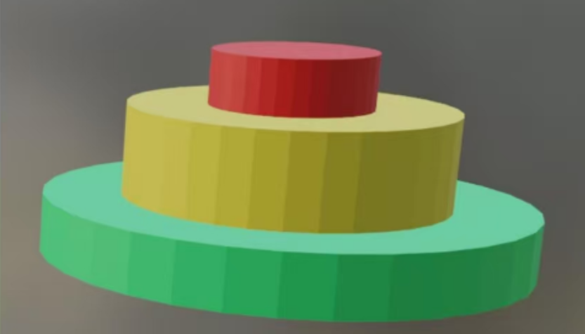
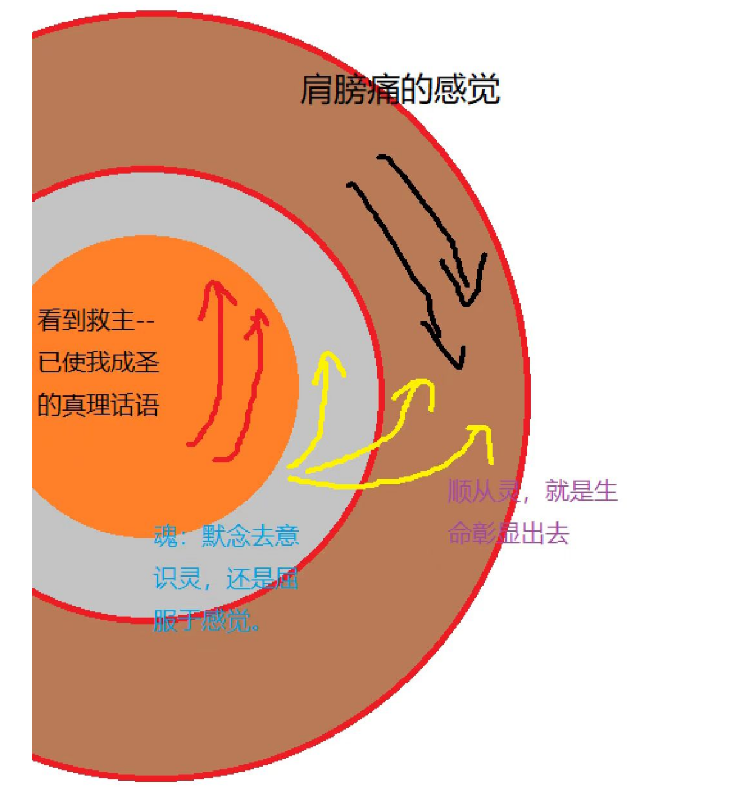
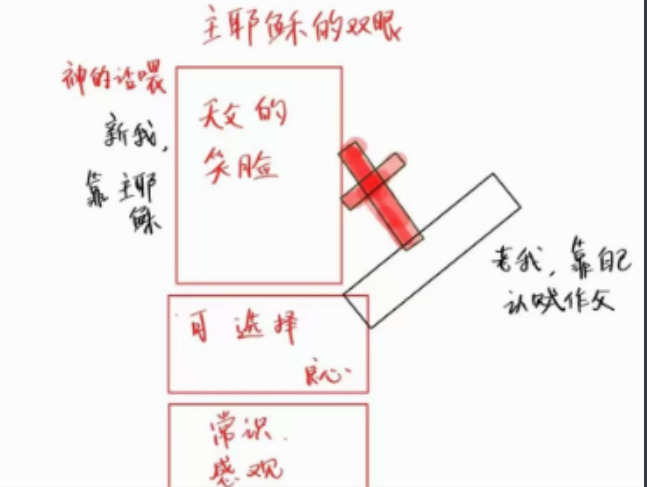
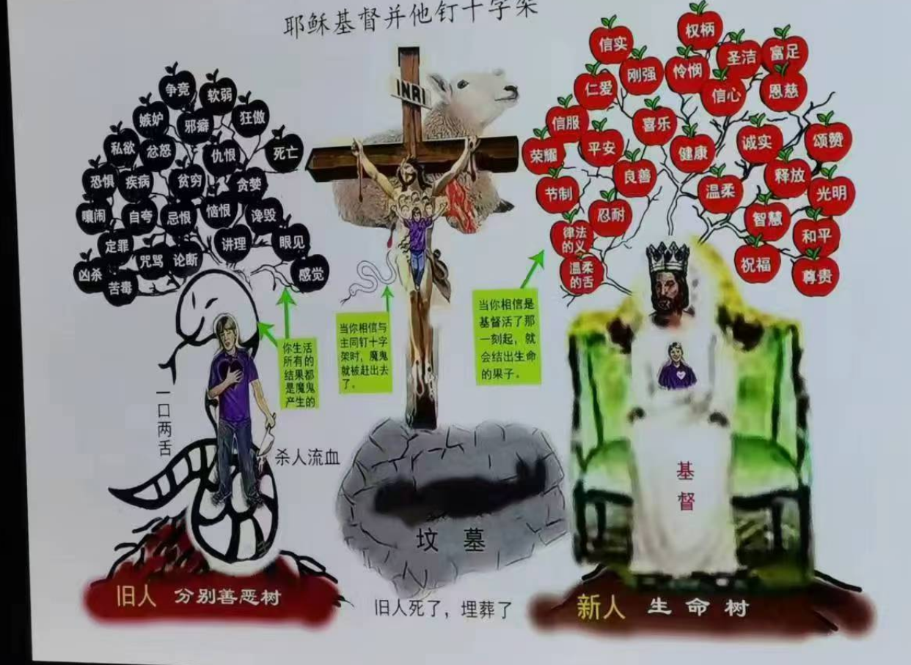
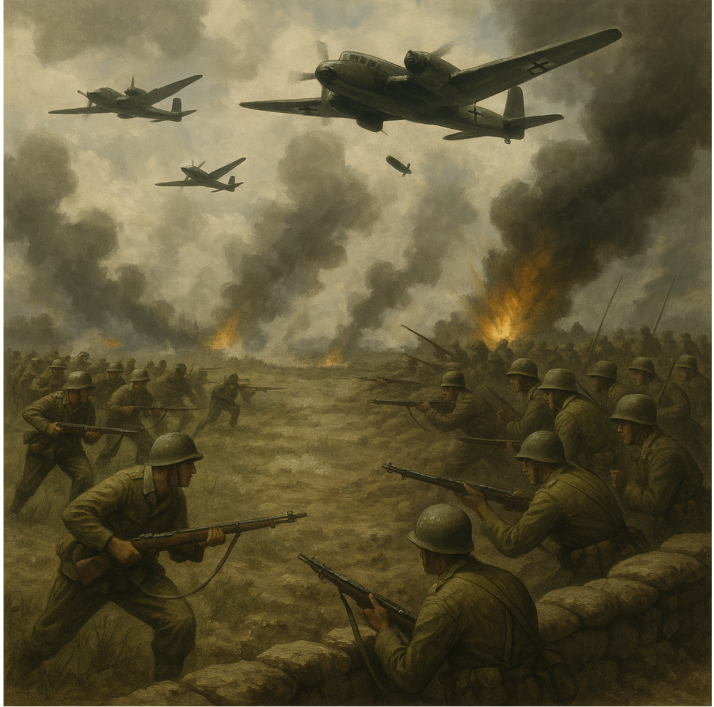
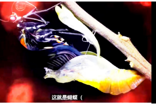
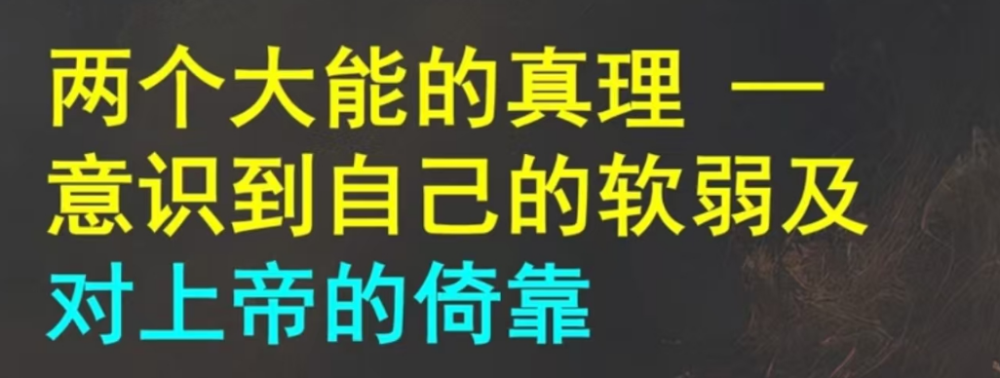
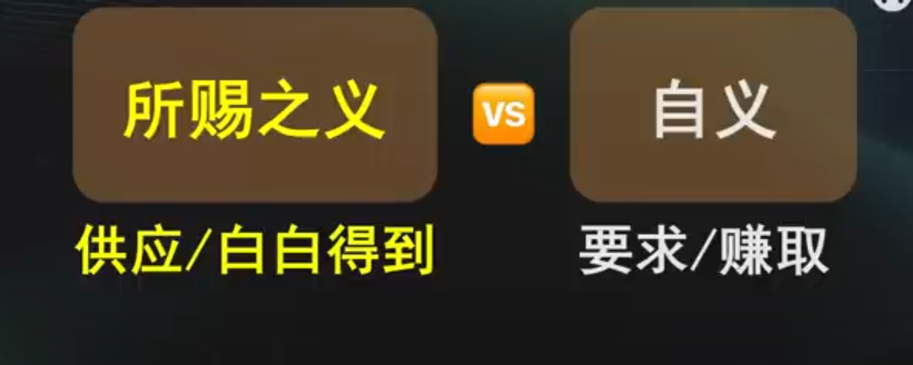

# 灵的生命

我们首先要分清，灵魂体。不信的人，他的灵是死的，只能在地上跟魔鬼缠斗。我们多了一个活着的灵，这个灵是我们真实的身份。

# 灵魂体的关系

## 2.1灵魂体是不同部分

当神对亚当说，你吃的日子那果子必定死。注意这里的时间，是当天必定死。在亚当吃了之后，肉体他没有死呀，又活了八百多岁。但是神不可能说谎呀？那亚当吃了果子当天到底有没有死呢？

1.  从灵的视角，他就是死了，其实与神隔绝就是死了。
2.  从肉体的视角，他又苟延残喘了好多年。
3.  这里我们也看到**体**有时候会比**灵**滞后，**灵**是光速的，所以我们信主的当下，**灵**就立刻圣洁了。哈利路亚！

## 2.2灵魂体相互作用

灵**高于**魂和体，如图所示：

灵处于高位，能够大大的影响魂和体。可以把灵比作军队的司令。我们信徒的灵，就是我们的元帅主基督耶稣的灵，所以是至圣的，是和天父上帝合二为一。哈利路亚！

魂位于是灵与体之间，起到一个的开关的作用，相当于军队的中层干部，比如就将魂比作团长。团长的选择权在自己手里：

1. 团长选择听元帅的，就复兴我们的身体，我们就打胜仗
2. 团长不听元帅的，总是跟下面几个捣蛋鬼乱搞，我们就吃败仗。

也可以通过下面的平面图来体现三者的关系：

    

注意这里我们的魂：

1. 是回应，是**向上**的，回应我们的主的话，他说了：因他受的鞭伤我得了医治。我魂的面向在于我们主的话语。
2. 不是反应，不是在现象的对立面，**平级的**跟他对着干。而是尽量的不去跟他拉扯，他会控告我：你没有照顾好自己的身体，你太多久坐了。我的态度：我承认，我的肉体就是没有良善，该运动反而不去运动。我对于*自己能照顾好自己*这件事彻底的绝望。那个错待自己身体的老我，已经和我的主一起钉死在十字架上了。

再画一个图表达魂处于承上启下的中转作用：

# 靠什么能重生

我们的重生是靠着我们的主耶稣基督，也只能靠我们的主耶稣基督。重生不是缝缝补补的生命，而是**重生**，慢慢品一品：重生就要先死一个；再重新活过来一个。

1. 我彻底放弃我的旧生命：我承认我的肉体里面就是没有良善的，恶的无可救药了。靠着主耶稣在十字架肉身替我死，我的这个旧生命已经埋葬了，盖棺定论了。
2. 我欢迎主赐给我的新生命：**基督复活，是为叫我称义**。没有一点点我自己的功劳，完全是因为我的主替我还清了罪债，祂又复活了，回到了父的右边，在天父的右边代表我。如今我的生命是藏在基督里面的，所以我也在父的右边（靠的是主基督作为中保）。也就是我的重生灵，现在就在天父阿爸的面前，已经成为圣洁，没有瑕疵，无可责备。哈利路亚！

我们发现了，从老思维到新思维的转换必须靠着主耶稣，所以说**他是门**：

借用昆明家人们的图，我们也可以看到，两棵树之间必须通过福音（主耶稣的十字架受死、埋葬、复活）才能转过去。祂是 **唯一的道路**，帮我们达到父面前，也就是奇妙光明的新国度。

# 怎样应用

关键在于一个**苏醒**。从旧我的思维里面跳出来，靠着主跳出来，进入新的思维。注意：不是对抗对方，而是去看主耶稣，不自觉的就抬举出来了。

举几个形象的例子：

## 我有一支空军

大家看，左右两军对战，如果我们用血气征战，就浪费了我们主给我们的大大好处，我们有空军呀，我们的灵是凌驾在现象之上的。

举个例子：太太说我为什么不陪她见朋友，我也跟她辩驳了好久。讲理，其实是分辨善恶，就是在地上纠缠，既伤到自己又伤到家人。直到过了一会，主带领我苏醒过来：我们征战的根本不是人，而是背后的魔鬼，他拿着我里面**喜欢争竞的老习惯**在操控我。但是如果我们苏醒过来：

1. 我的旧生命已经死了：我的老我就是喜欢争竞、讲理，容易发脾气的，本来就没有一点点良善。但是那个罪（凡是亏缺神的荣耀都是罪）已经钉死在我的主身上了。他心甘情愿的替我担当。关键**不在于**我去治死那个老我，关键在于我的主对那个老我做了什么。向罪当**看**自己是死的，我之所以能够看他是死的，完全是因为：圣洁的主，一人替我死，我就真死了。已死的人就脱离了罪。何等的释放！哈利路亚！
2. 我的新生命和基督一同藏在神的里面：复活的主是温柔的，门徒们害怕，他却没有一点指责。复活的主现在公平公正的住在我现在的身体里面。神凭着基督看我是爱太太，爱家人的。

这样一苏醒，我发现我可以不争了，抱一下太太，洗一下碗，这个事就过去了。哈利路亚！

## 你敢下来吗

魔鬼就是在下面，用律法**控告和纠缠**。我尽力避免跟他用律法辩驳，而是**向着律法我已经死了**。当我承认，我就是没有良善，我的罪身已经全部钉死在我的主耶稣身上，我就坐在了石头上。难怪经上记着说，**他是我们的磐石**。我单单定睛我的主，我不需要自己努力往上爬。当我定睛祂的时候，他的笑脸接纳外在软弱的我。慢慢的，他的喜乐、平安就充满了我的魂，我的思维就被拉上去了。哈利路亚！

魔鬼有时候会说：你敢下来吗？敢和对峙你的行为吗？ 唉，我就是不敢，怎么了。我根本不下去，我不要从恩典中坠落，我在爱我的主里面，高高的，多么好。我才不要傻傻的下去，靠自己跟他缠斗。

## 一抓就跑

根本不跟他纠缠，魔鬼一控告，我马上抱我主耶稣的大腿，溜了。不是说：灵巧如蛇吗？哈哈

## 壳子不是我

我的旧人的行为，已经钉死了，壳子不是我。

## 其他例子

